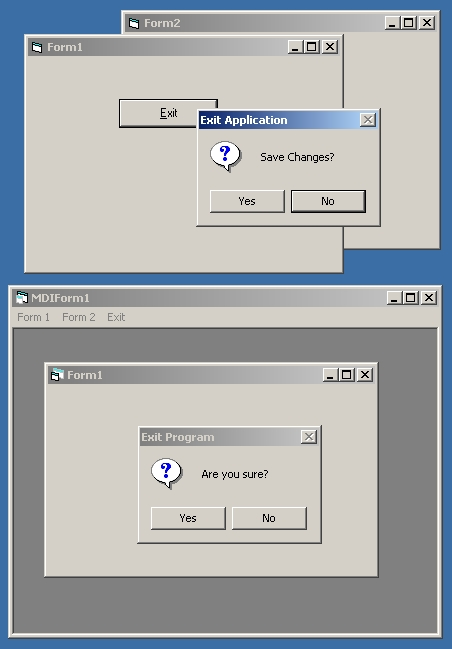

<div align="center">

## How\-to exit an application correctly


</div>

### Description

This article demonstrates how to exit an application cleanly with user prompting (if required) without using the END Statement.
 
### More Info
 


<span>             |<span>
---                |---
**Submitted On**   |2001-08-12 16:45:30
**By**             |[Slider](https://github.com/Planet-Source-Code/PSCIndex/blob/master/ByAuthor/slider.md)
**Level**          |Beginner
**User Rating**    |3.9 (27 globes from 7 users)
**Compatibility**  |VB 4\.0 \(32\-bit\), VB 5\.0, VB 6\.0
**Category**       |[Object Oriented Programming \(OOP\)](https://github.com/Planet-Source-Code/PSCIndex/blob/master/ByCategory/object-oriented-programming-oop__1-47.md)
**World**          |[Visual Basic](https://github.com/Planet-Source-Code/PSCIndex/blob/master/ByWorld/visual-basic.md)
**Archive File**   |[Exit Appli244968122001\.zip](https://github.com/Planet-Source-Code/slider-how-to-exit-an-application-correctly__1-26111/archive/master.zip)


### Source Code

```
Too many programmers these days use the end statement in their programs and under certain conditions leave fragements behind in memory, the application doesn't shut down fully, or in extreme cases cause GPFs.
To unload applications correctly, the statement 'Unload Me' should be used. The 'Form_QueryUnload' event will be triggered and at this point we should ask the user what to do. The reason why we should put a "Save Changes" propmt in the 'Form_QueryUnload' event is that there is more than one way to close an application. If the System Shutdown is invoked, or the Close "X" button is pressed, then we can catch these events and give the user a chance to save thier work.
Attached are two framework applications to demostrate how to close A) SDI application and B) MDI application.
If you find this article & code useful, then please leave me a comment and I'll add more useful articles.
```

